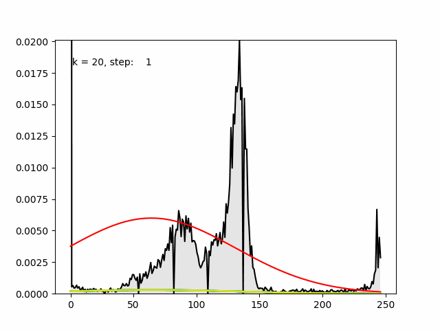
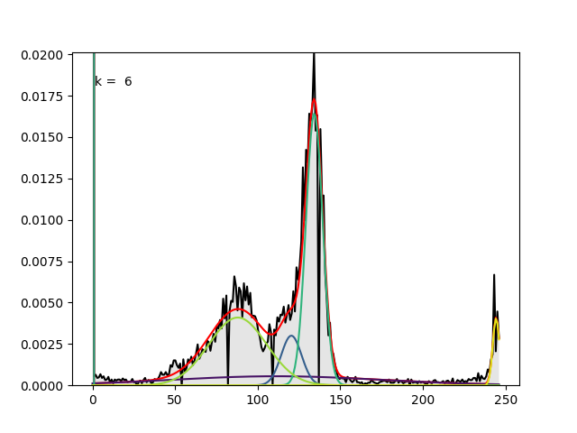
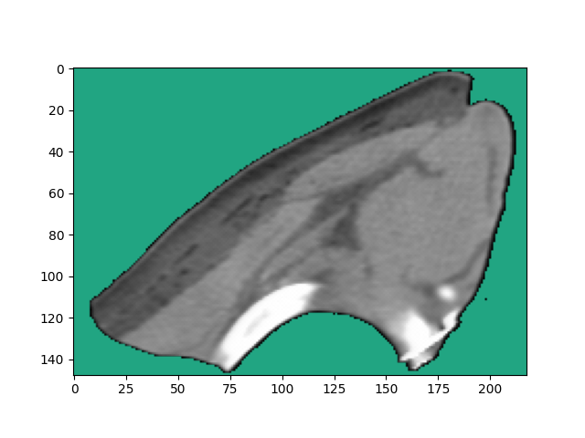
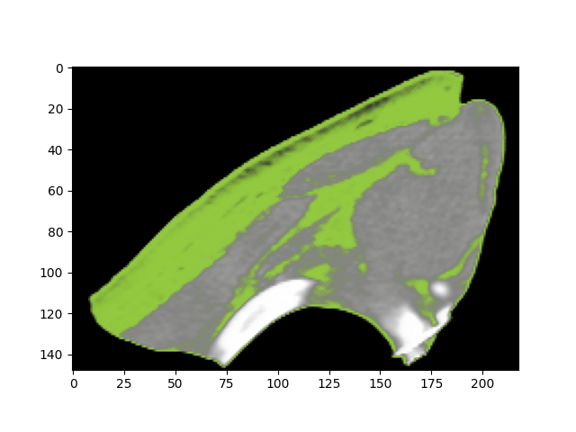
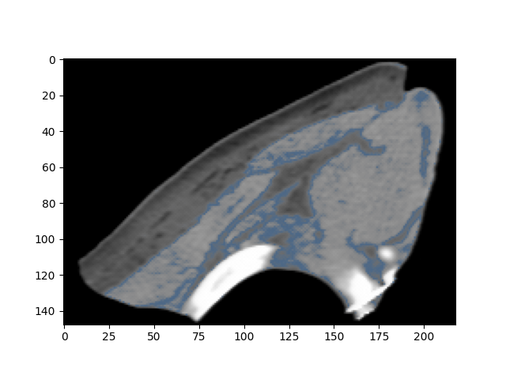
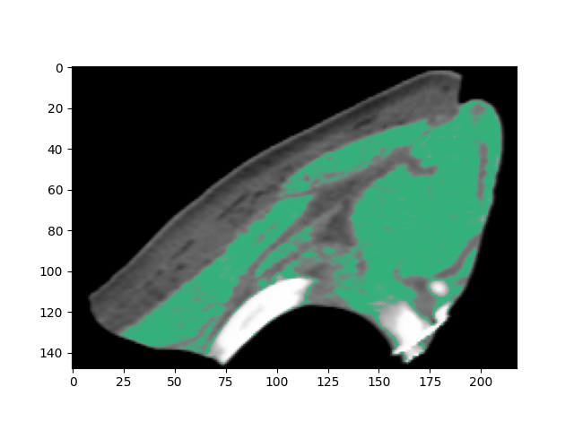
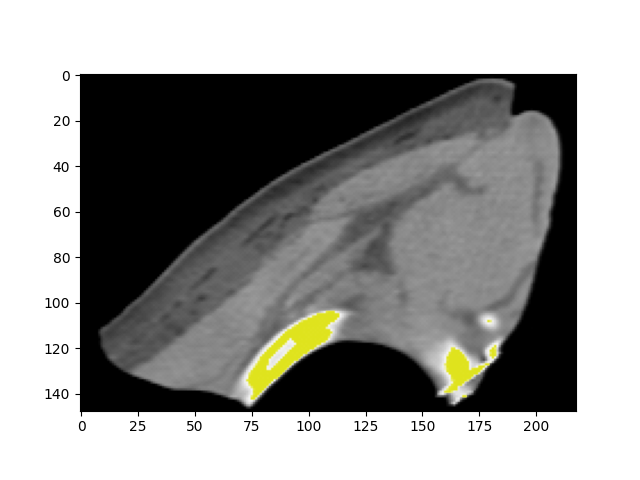
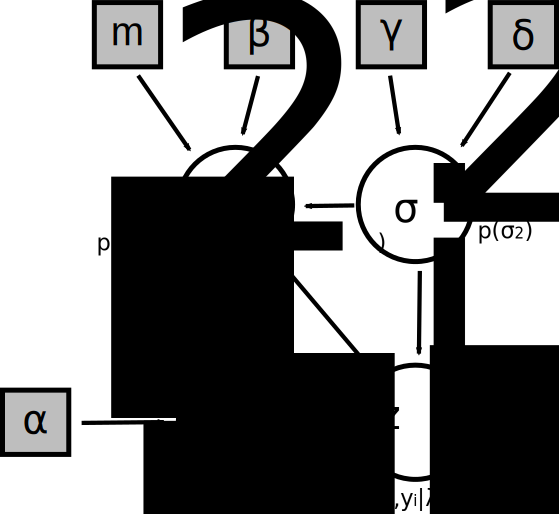

# Variational Bayesian Inference - A case study with multivariate Gaussian approximation

This project was part of a seminar during my Master studies in 
[Theoretical and Mathematical Physics](https://www.theorie.physik.uni-muenchen.de/TMP/) in 2018.
It's a small python project to classify an unknown amount of components in e.g. a CT scan.

The whole project is largely based on a case-study by Clare Anne McGrory documented in her PhD Thesis 
"Variational Approximations in Bayesian Model Selection".


## Example: CT Scan of pork carcase

As an example the CT scan of a pork carcase is analysed in order to classify different tissues.

*See also the original case study in chapter 23 in the book [Case Studies in Bayesian Statistical Modelling and Anaylis](https://www.wiley.com/en-us/Case+Studies+in+Bayesian+Statistical+Modelling+and+Analysis-p-9781119941828)*

Timelaps of approximation (`k` being the number of components still in the race):


### Results

Final approximation (starting with k=20 components) with k=6 components:



Among other things we can visualize the probability that a pixel in the original scan belongs to one of the 6 components.



The first component (sharp peak to the left in the histogram above) specifies the background.

Another component coincides with fat tissue:



Two components can be identified as muscle tissue:





Another one as bone:




## Working with the source code

Install dependencies including the dev dependencies:

    pip install -e .[dev]

## Theory overview

*For a more detailed description see the complementary [presentation](presentation.pdf).*

The project approximates the posterior of a multivariate gaussian bayesian hierarchical model.
It assumes that a dataset $`y`$ is distributed according to an unknown number of gaussian distributed components:
```math
p(y_i | \mathbf \lambda, \mathbf \mu, \mathbf \sigma ) = \sum_{j=1}^N \lambda_j \mathcal N (y_i; \mu_j, \sigma_j)
```

Full model boils down to the following system of parameters:



The following priors are used in the hierarchical model:
* $`\mu`$: Normal distributed with mean $`m`$ and variance $`\beta^{-1}\sigma^2`$
* $`\sigma^2`$: Inverse gamma distributed with shape $`0.5 \gamma`$ and scale $`0.5 \delta`$
* $`\lambda`$: Dirichlet distributed with concentration parameters $`\alpha`$


